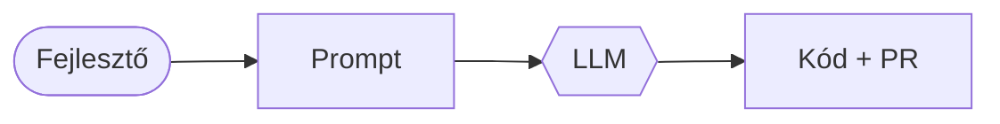

# Ágens munkafolyamat

Egy ügynök munkafolyamata.

- Mermaid flowchart → 3D
- Szemantika: diagram.db
- Layout: dagre

```mermaid
flowchart LR
  U([Fejlesztő]) --> P[Prompt]
  P --> L{{LLM}}
  L --> K[Kód + PR]
```

# Összegzés

A jövő már itt van.
