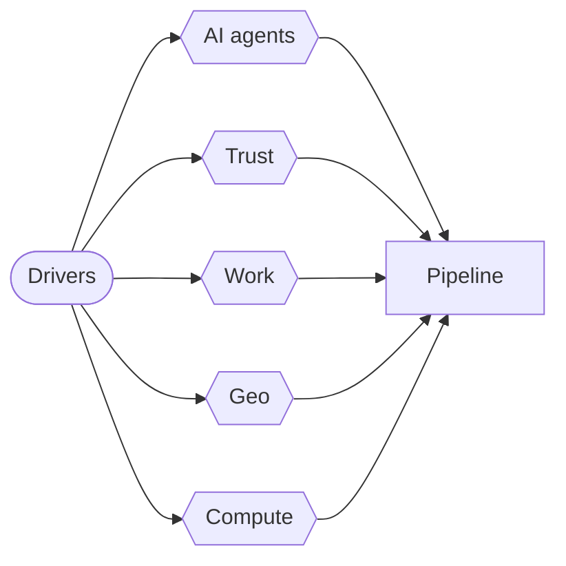
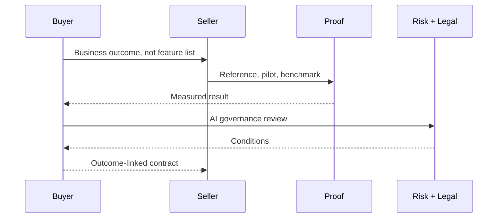

# How Business Changes by 2031

AI, fragmentation and trust: what it means for sellers

- Evidence-led forecast, not hype
- Built for software & IT services sales
- Sources: WEF, Stanford HAI, Forrester

<!-- deck3d: {"camera":{"distance":12},"check":{"ignore":["contrast"]}} -->

# Five Forces to 2031 {#forces}

The macro drivers reshaping every deal you will work

<!-- deck3d: {"camera":{"distance":15},"diagram":{"scale":1.0},"labels":{"size":0.2},"check":{"ignore":["contrast"]}} -->

# Adoption Broke Every Record {#adoption}

Faster than the PC. Faster than the internet.

- Organizational AI adoption: 88%
- GenAI in a business function: 70%
- 53% population adoption in three years
- 4 in 5 university students use generative AI

<!-- deck3d: {"camera":{"distance":12},"check":{"ignore":["contrast"]}} -->

# The Agent Gap Is the Opportunity {#agentgap}

Everyone bought AI. Few run agents.

- Agent deployment: single digits everywhere
- Adoption is broad and shallow
- The 2026–2031 money is in depth, not first contact
- Ask: what is actually in production

<!-- deck3d: {"camera":{"distance":12},"check":{"ignore":["contrast"]}} -->

# Force 2: The Trust Correction {#trust}

Forrester 2026: proof over promises

- 2025 ended in overly enthusiastic AI ambition
- Buyers now demand evidence, not vision decks
- AI adoption outpaced governance
- Differentiation: trust and measured value

<!-- deck3d: {"camera":{"distance":12},"check":{"ignore":["contrast"]}} -->

# How the Deal Actually Runs Now {#dealflow}

Proof gates appear before commercial terms

<!-- deck3d: {"camera":{"distance":13},"diagram":{"scale":1.3},"labels":{"size":0.26},"check":{"ignore":["contrast"]}} -->

# Force 4: Geoeconomics Rewrites Strategy {#geo}

WEF Global Risks Report 2026 — an age of competition

- #1 risk 2026-2028: geoeconomics
- 34% expect a business-model change
- 68% expect a fragmented order by 2036
- Sovereignty enters procurement

<!-- deck3d: {"camera":{"distance":12},"check":{"ignore":["contrast"]}} -->

# Force 5: Concentrated Physical Reality {#compute}

Intelligence runs on a very narrow supply chain

- US hosts 5,427 data centers, 10x any other country
- One Taiwanese foundry makes the chips
- Energy and capex are now board-level constraints
- Price, latency, locality become terms

<!-- deck3d: {"camera":{"distance":12},"check":{"ignore":["contrast"]}} -->

# Monday Morning {#monday}

Do these before the forecast call

- Audit accounts for live AI usage
- Swap a promise slide for a proof point
- Name the governance stakeholder
- Book your own reskilling hours this quarter

<!-- deck3d: {"camera":{"distance":12},"check":{"ignore":["contrast"]}} -->

# Sources {#sources}

Everything above is dated and traceable

- WEF Future of Jobs 2025 (1,000+ employers)
- Stanford HAI AI Index 2026
- WEF Global Risks Report 2026 — 1,300+ experts
- WEF + PwC, Entry-Level Work, Jun 2026
- Forrester Predictions 2026

<!-- deck3d: {"camera":{"distance":12},"check":{"ignore":["contrast"]}} -->
