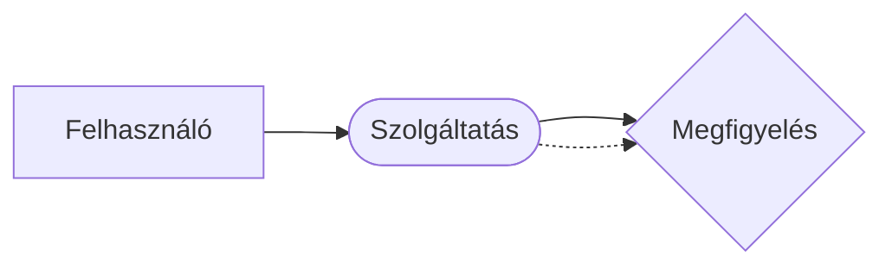
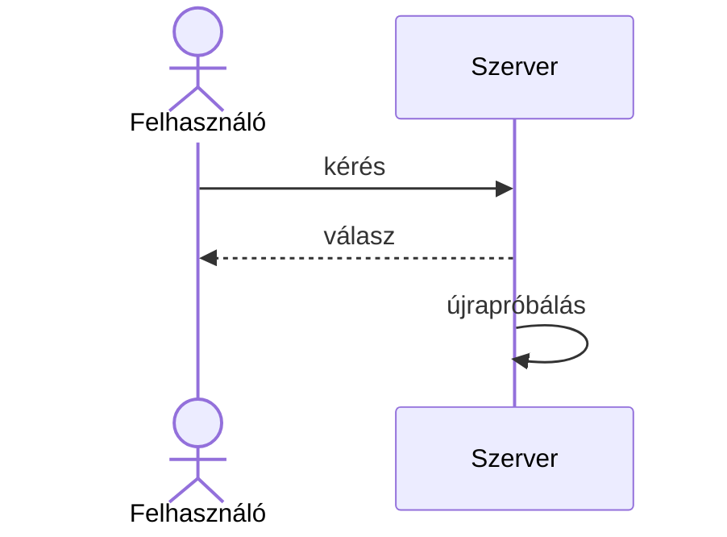

# Rendszer

A bemutató diák.

```mermaid
flowchart LR
  A[Felhasználó] --> B([Szolgáltatás])
  B --> C{Megfigyelés}
  B -.-> C
```

# Folyamat

Az üzenetváltás.

```mermaid
sequenceDiagram
  actor U as Felhasználó
  participant S as Szerver
  U->>S: kérés
  S-->>U: válasz
  S->>S: újrapróbálás
```
