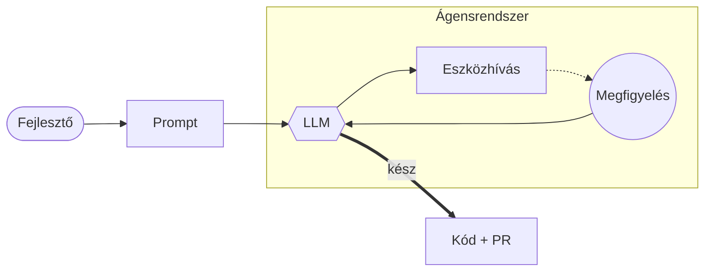
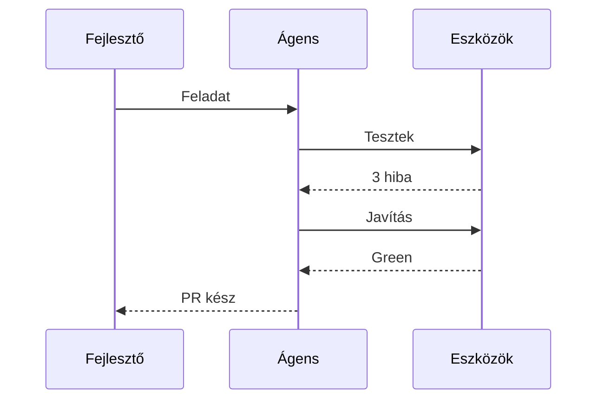

# Az LLM-től az Ágensrajokig

Az autonóm szoftverfejlesztés új korszaka

# Mi az LLM?

- Olvasott kolléga
- Nyelvi minták
- Gondolkodik, de nem cselekszik

# Agent Loop

- Plan → Act → Observe
- Önkorrekció
- Ciklikus működés

# Agent Swarm (2025)

- Szakosodott ágensek
- Együttműködés
- 1445% növekedés

# Ágens munkafolyamat

- Mermaid flowchart → 3D
- Layout: mermaid/dagre
- Szemantika: diagram.db

# Javítási ciklus

- Mermaid sequence → 3D
- Idő = mélység
- Üzenetek sorban világítanak

# Köszönöm a figyelmet!

- AI = operációs rendszer
- Ember + gép együttműködés
- A jövő már itt van
