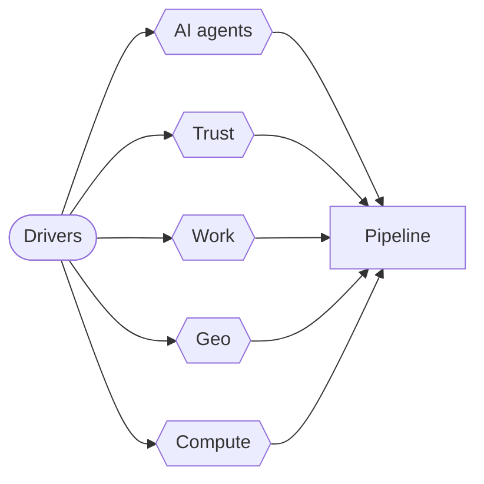
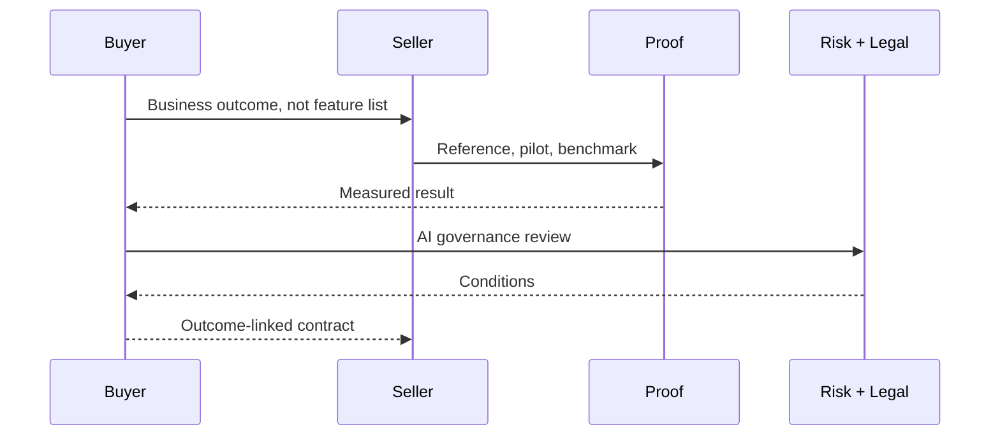
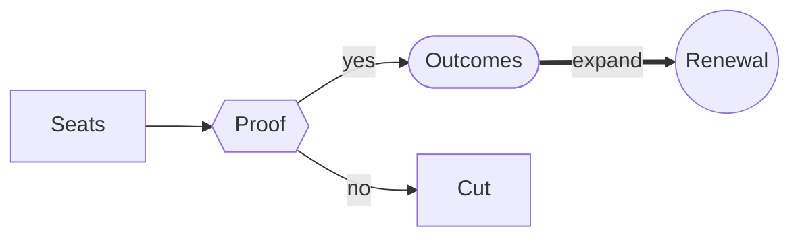
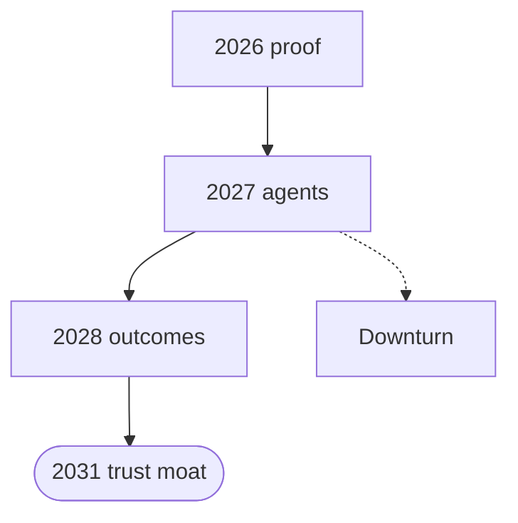

# How Business Changes by 2031

AI, fragmentation and trust: what it means for sellers

- Evidence-led forecast, not hype
- Built for software & IT services sales
- Sources: WEF, Stanford HAI, Forrester

<!-- deck3d: {"camera":{"distance":12},"check":{"ignore":["contrast"]}} -->

# Why This Talk {#why}

Your quota survives. Your playbook does not.

- Buyers changed faster than sellers
- Proof now beats promise
- Everything here is sourced and dated

<!-- deck3d: {"camera":{"distance":12},"check":{"ignore":["contrast"]}} -->

# Five Forces to 2031 {#forces}

The macro drivers reshaping every deal you will work

<!-- deck3d: {"camera":{"distance":15},"diagram":{"scale":1.0},"labels":{"size":0.2},"check":{"ignore":["contrast"]}} -->

# Force 1: Capability Is Not Plateauing {#capability}

Stanford HAI AI Index 2026

- SWE-bench Verified: 60% to near 100% in one year
- Matches human baselines on PhD-level science
- Agents on real computer tasks: 12% to 66% success
- US–China model gap effectively closed

<!-- deck3d: {"camera":{"distance":12},"check":{"ignore":["contrast"]}} -->

# The Jagged Frontier {#jagged}

Superhuman and incompetent in the same system

- IMO gold medal, but clocks read right 50.1%
- Agents still fail roughly 1 in 3 structured tasks
- Capability is spiky, not uniform
- Sell the spike, scope around the gap

<!-- deck3d: {"camera":{"distance":12},"check":{"ignore":["contrast"]}} -->

# Adoption Broke Every Record {#adoption}

Faster than the PC. Faster than the internet.

- Organizational AI adoption: 88%
- GenAI in a business function: 70%
- 53% population adoption in three years
- 4 in 5 university students use generative AI

<!-- deck3d: {"camera":{"distance":12},"check":{"ignore":["contrast"]}} -->

# The Agent Gap Is the Opportunity {#agentgap}

Everyone bought AI. Few run agents.

- Agent deployment: single digits everywhere
- Adoption is broad and shallow
- The 2026–2031 money is in depth, not first contact
- Ask: what is actually in production

<!-- deck3d: {"camera":{"distance":12},"check":{"ignore":["contrast"]}} -->

# Money Moved, Then Got Strict {#money}

Record investment arriving with record scrutiny

- US private AI investment: $285.9B in 2025
- Corporate AI investment doubled in 2025
- Google alone: $150B+ annual capex
- Consumer value from free tools: $172B/year

<!-- deck3d: {"camera":{"distance":12},"check":{"ignore":["contrast"]}} -->

# Force 2: The Trust Correction {#trust}

Forrester 2026: proof over promises

- 2025 ended in overly enthusiastic AI ambition
- Buyers now demand evidence, not vision decks
- AI adoption outpaced governance
- Differentiation: trust and measured value

<!-- deck3d: {"camera":{"distance":12},"check":{"ignore":["contrast"]}} -->

# How the Deal Actually Runs Now {#dealflow}

Proof gates appear before commercial terms

<!-- deck3d: {"camera":{"distance":13},"diagram":{"scale":1.3},"labels":{"size":0.26},"check":{"ignore":["contrast"]}} -->

# Force 3: Work Gets Redesigned {#work}

WEF Future of Jobs 2025 — 2025 to 2030

- 22% of today's jobs churn by 2030
- 170M roles created, 92M displaced, net +78M
- 40% cut roles where AI automates
- Half of employers re-orient the business around AI

<!-- deck3d: {"camera":{"distance":12},"check":{"ignore":["contrast"]}} -->

# Skills Beat Headcount {#skills}

39% of skill sets expire by 2030

- Fastest-growing: AI, data, cybersecurity
- Still #1 core skill: analytical thinking
- Rising: creative thinking, resilience, curiosity
- 63%: skill gaps are the top barrier

<!-- deck3d: {"camera":{"distance":12},"check":{"ignore":["contrast"]}} -->

# The 59-in-100 Problem {#reskill}

If the workforce were 100 people

- 59 need training by 2030
- 29 upskilled in place, 19 redeployed
- 11 get nothing — and their prospects erode
- 85% of employers prioritize upskilling

<!-- deck3d: {"camera":{"distance":12},"check":{"ignore":["contrast"]}} -->

# The Entry-Level Squeeze {#entry}

Where the damage is already measurable

- Devs aged 22-25: employment down ~20%
- 1 in 3 young workers sit in AI-exposed occupations
- 1 in 3 orgs expect AI-driven cuts
- Your future buyers are being trained differently

<!-- deck3d: {"camera":{"distance":12},"check":{"ignore":["contrast"]}} -->

# Force 4: Geoeconomics Rewrites Strategy {#geo}

WEF Global Risks Report 2026 — an age of competition

- #1 risk 2026-2028: geoeconomics
- 34% expect a business-model change
- 68% expect a fragmented order by 2036
- Sovereignty enters procurement

<!-- deck3d: {"camera":{"distance":12},"check":{"ignore":["contrast"]}} -->

# Force 5: Concentrated Physical Reality {#compute}

Intelligence runs on a very narrow supply chain

- US hosts 5,427 data centers, 10x any other country
- One Taiwanese foundry makes the chips
- Energy and capex are now board-level constraints
- Price, latency, locality become terms

<!-- deck3d: {"camera":{"distance":12},"check":{"ignore":["contrast"]}} -->

# Productivity Is Real — Where Work Is Measurable {#productivity}

The evidence is uneven, and that is the useful part

- Customer support: 14–15% gains
- Software development: 26%
- Marketing output: 50%
- Deep reasoning: smaller, riskier gains

<!-- deck3d: {"camera":{"distance":12},"check":{"ignore":["contrast"]}} -->

# The Business Model Shift {#model}

Software & IT services: from seats to outcomes

<!-- deck3d: {"camera":{"distance":13},"diagram":{"scale":1.3},"labels":{"size":0.2},"check":{"ignore":["contrast"]}} -->

# What Changes in Your Job {#sales}

Five shifts for client-facing teams

- Bring benchmarks to the first call
- A governance reviewer joins every deal
- Quantify the client's agent gap
- Reskilling becomes part of the offer
- Trust is scarce: it is your product

<!-- deck3d: {"camera":{"distance":12},"check":{"ignore":["contrast"]}} -->

# Timeline to 2031 {#timeline}

A plausible, evidence-anchored sequence

<!-- deck3d: {"camera":{"distance":15},"diagram":{"scale":0.95},"labels":{"size":0.2},"check":{"ignore":["contrast"]}} -->

# Monday Morning {#monday}

Do these before the forecast call

- Audit accounts for live AI usage
- Swap a promise slide for a proof point
- Name the governance stakeholder
- Book your own reskilling hours this quarter

<!-- deck3d: {"camera":{"distance":12},"check":{"ignore":["contrast"]}} -->

# What Would Prove Me Wrong {#wrong}

Honest failure modes for this forecast

- Downturn freezes budgets early
- Hard regulation lands: #5 risk by 2036
- Capability plateaus unexpectedly
- Trust collapses faster than proof can be produced

<!-- deck3d: {"camera":{"distance":12},"check":{"ignore":["contrast"]}} -->

# Sources {#sources}

Everything above is dated and traceable

- WEF Future of Jobs 2025 (1,000+ employers)
- Stanford HAI AI Index 2026
- WEF Global Risks Report 2026 — 1,300+ experts
- WEF + PwC, Entry-Level Work, Jun 2026
- Forrester Predictions 2026

<!-- deck3d: {"camera":{"distance":12},"check":{"ignore":["contrast"]}} -->
